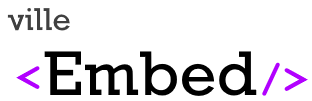
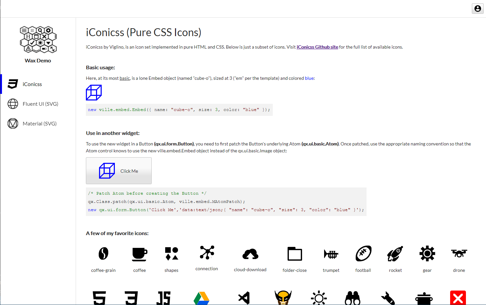
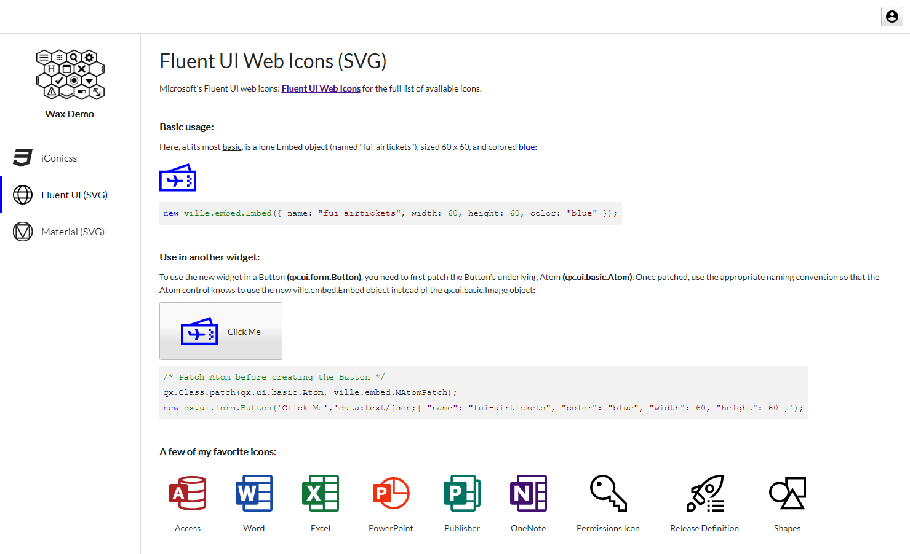

<!-- PROJECT LOGO -->
<br />
<p align="center">
  <a href="https://github.com/sqville/ville.Embed">
    
  </a>

  <h3 align="center"></h3>

  <p align="center">
    A control for the Qooxdoo JavaScript Framework
  </p>
</p>

<!-- ABOUT THE PROJECT -->
## About The Project

**ville.Embed** is a [Qooxdoo](https://qooxdoo.org/) control designed to make images, icons and graphics more dynamic.

**Benefits**
* Use pure CSS icons in your project using the amazing [iConicss](https://github.com/Viglino/iconicss) icon set
* Embed SVG icons in your project using code, or a combination of code and HTML5's template tag

**Screen Shots**




<!-- GETTING STARTED -->
## Using the Control in your Application
To use the control in your application, go into the application root directory and install the library into your project:
```sh
$ qx package update
$ qx package list
$ qx package install sqville/ville.Embed
```
**Getting started with iConicss icon set:**

**Step 1** - Make sure iConicss's minified css file is identified as an external resource in your project's Manifest.js file
```sh
  "externalResources": {
    "css": ["ville/embed/iconicss.min.css"]
  },
```
**Step 2** - Understand how to add an embed item to your project. Let's add the Hulk to your project as an illustration. Open up the IconIcss.js file that's in the ville\embed\package folder. Package files are static and only contain the following static members: **META** (meta information about the package), **EMBEDS** (The list of embeds in the package), **TEMPLATES** (The list of templates in the package. A single template can be used by multiple embeds), **CONTENT** (Normally cotains SVG path data), **CSS** (A list of class rules and class text. Populate this if you want your CSS all in js files rather than external css files) and **ANIMATIONS** (qooxdoo animation available to any package).

Add "hulk-c" embed entry. Make sure your entry has template and class values. Search the iconicss.min.css file for "hulk" to get the name of the class ("icss-hulk-c" in this case). Make sure you have the entries noted below:
```sh
  // Named icons/graphics configurations
    EMBEDS :
    {
      "hulk-c" : { template : "icss-single-element", class : "icss-hulk-c"}
    }

    TEMPLATES :
    {
      "icss-single-element" : '<i class="{{class}}" style="font-size:{{size}}em; color:inherit;"></i>'
    },
```
**Step 3** - Create the ville.embed.Embed object in your code and add it to your application (it's a widget):
```sh
  var embedHulk = new ville.embed.Embed({ name: "hulk-c", size: 3 });
```

**Patch qx.ui.basic.Atom to get iConicss icons in a Button:**

**Step 1** - Include a Mixin that patches qx.ui.basic.Atom so that the Atom can recognize when to create a ville.embed.Embed instead of an Image. **IMPORTANT NOTE:** This is changing the core of a shared framework object. Please conduct regression testing before releaseing code past Dev: 
```sh
  qx.Class.patch(qx.ui.basic.Atom, ville.embed.MAtomPatch);
```
**Step 2** - Create the qx.ui.form.Button. Use "data:text/json;" along with valid json to use an embeded object rather than an image:
```sh
  var btnHulkButton = new qx.ui.form.Button('Hulk Smash!','data:text/json;{ "name": "hulk-c", "size":3 }');
```

<!-- DEMO -->
## Demo
See this control in action using the ville [Wax Demo App](http://qooxdoo.org/qxl.packagebrowser/qxl.packagebrowser/demos/sqville/ville.Embed/waxdemo/)

<!-- ROADMAP -->
## Roadmap

TBD


<!-- LICENSE -->
## License

Distributed under the MIT License. See `LICENSE` for more information.


<!-- CONTACT -->
## Contact

Chris Eskew - [@SQville](https://twitter.com/SQville) - email: chris.eskew@sqville.com